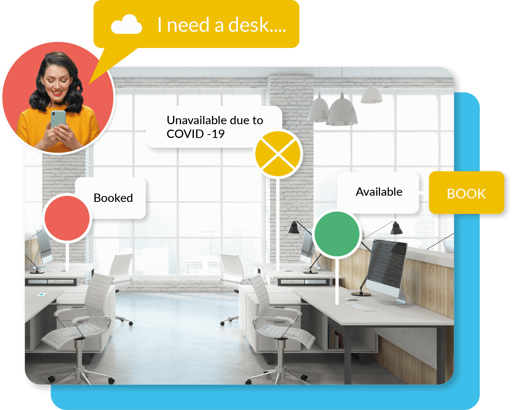

<h1 align="center"> WorkMate </h1>
<!-- <p align="center">This project is designed to </p> -->


### Description
Our solution mainly consists of functionality and software components.
   
 - A desk booking system to help with space management.
  
 - A Stack Oveflow inspired software for asking questions and receiving answers from work mate on several topics


## Setup

  ##### Clone the repository
```bash
git clone https://github.com/seths10/WorkMate.git
```
  ##### To run the frontend, navigate to the \`_client_` directory
```bash
cd client
```

  ##### To run the app server, navigate to the \`_api_` directory
```bash
cd api
```

## About
Our solution primarily deals with `Future of Education` and `Smart Technology for Sustainable Living`. We're the **Team SPAN**! 

##### Build by 

<p align="left">
<a href="https://github.com/seths10"></a>
<a href="https://github.com/shineteye"></a>
<a href="https://github.com/seths10"></a>
<a href="https://github.com/shineteye"></a>

</p>

[](https://github.com/seths10/WorkMate)
